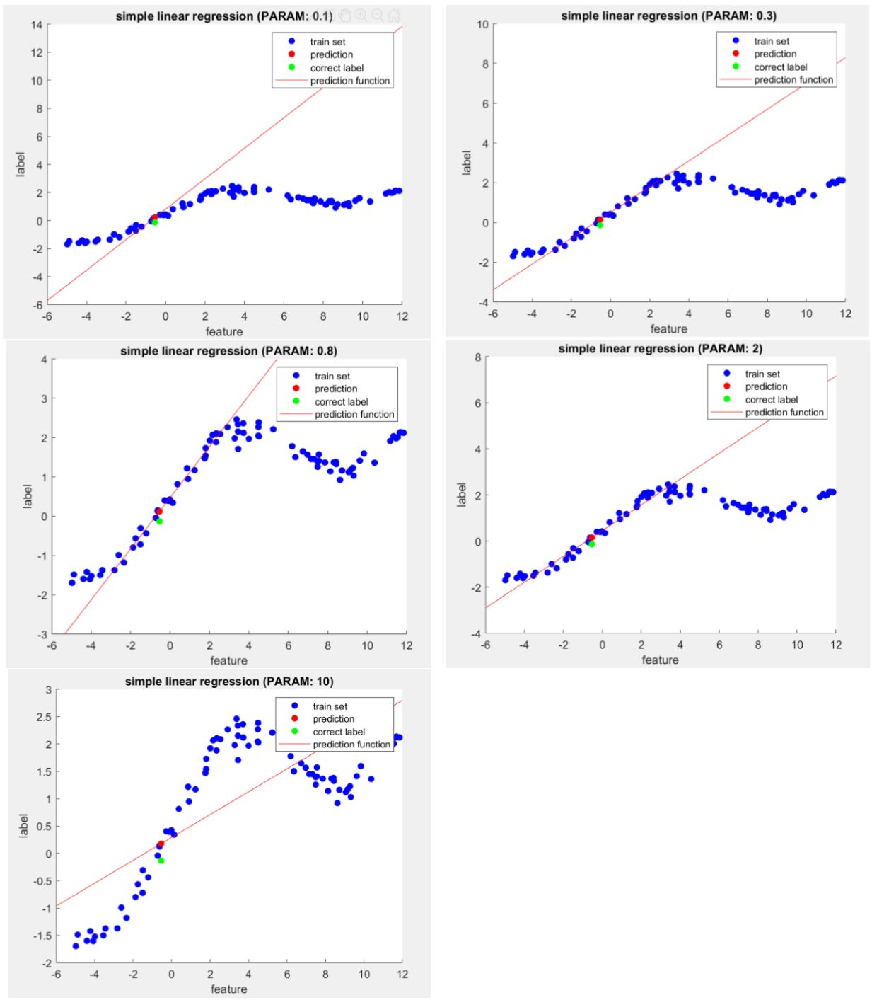

# Weighted-Linear-Regression

This codes provides a theoritical implementation of the Weighted Linear Regression from scratch.
The purpose of this code is to find the best fitting linear model to the data based on the test sample. The hyperparameter sepcifies the effectiveness of each entity in the training set based on their distance to the test sample. Hence this is a non-parametric method.

# output

A illustration of the output based on the hyperparameter is provided below.

